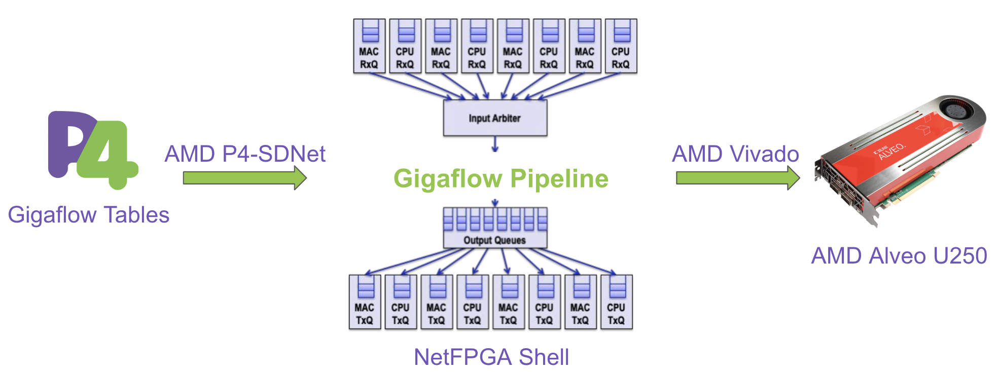
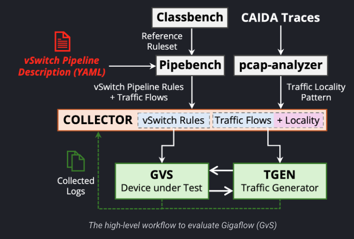

# Accelerating OVS with Gigaflow: A Smart Cache for SmartNICs

## GSoC 2025 Final Report
**Student**: Advay Singh  
**Project**: Accelerating Open vSwitch (OVS) with Gigaflow Smart Cache Implementation on SmartNICs  
**Organization**: The P4 Language Consortium
**Mentors**:Annus Zulfiqar, Ali Imran, Muhammad Shahbaz, David Scano, Murayyiam Parvez
---

## Executive Summary

This project successfully extends the Gigaflow Virtual Switch (GVS) (find out more [here](https://gigaflow-vswitch.github.io/)) framework to enable hardware acceleration on SmartNICs, specifically targeting NetFPGA platforms. The work bridges the gap between software-defined networking and hardware acceleration by implementing a complete pipeline from P4 code compilation to bitstream deployment and runtime rule management.

---

## Enhanced Gigaflow Virtual Switch (GVS)

The core contribution of this project is the extension of the Gigaflow Virtual Switch to support hardware acceleration through SmartNIC offload. The enhanced GVS maintains full backward compatibility with the software-only implementation while adding comprehensive hardware acceleration capabilities.

**Repository**: [Enhanced GVS](https://github.com/AdvaySingh1/gvs)

### Architecture and Design

The enhanced GVS implements a hybrid software-hardware architecture where the Gigaflow cache can operate in three distinct modes:

1. **Software-only Mode**: Traditional CPU-based packet processing with the original Gigaflow cache implementation
2. **Hardware-assisted Mode**: Critical path operations offloaded to SmartNIC while maintaining software control plane
3. **Full Hardware Mode**: Complete pipeline execution on SmartNIC with minimal CPU involvement

### Hardware Integration Layer

The hardware integration layer provides a unified abstraction for different SmartNIC platforms. The implementation includes:

**SDNet Driver Integration**: The enhanced GVS integrates with Xilinx's SDNet IP through custom drivers that handle rule installation, table updates, and statistics collection. The SDNet files included in the project are auto-generated when the bitstream is created through the Vivado software compilation process.

**Rule Translation Engine**: Converts high-level Gigaflow cache policies into hardware-compatible table entries and match-action rules that can be programmed into the P4 pipeline.
### Integration with Open vSwitch

The enhanced GVS maintains full compatibility with OVS through the existing datapath interface while extending it with hardware acceleration hooks. The integration supports:

- Standard OpenFlow protocol for rule installation
- OVS userspace utilities and management tools  
- Existing OVS-based orchestration platforms (OpenStack, Kubernetes)
- Custom extensions for hardware-specific optimizations

---

## Supporting Components

### Additional Orchestrators
- **MLX Orchestrator**: Initial framework for MLX NIC integration with traffic generation and performance benchmarking utilities
  - **Repository**: [MLX Orchestrator](https://github.com/AdvaySingh1/gigaflow-orchestrator)
- **NetFPGA Orchestrator**: Kernel-mode integration with comprehensive test suite for NetFPGA platforms, providing rule installation APIs and pipeline validation
  - **Repository**: [NetFPGA Orchestrator](https://github.com/AdvaySingh1/gigaflow-orchestrator-p4sdnet-offload)
- **P4 Behavioral Simulation**: Pre-deployment testing framework using Vivado simulation tools for comprehensive P4 code validation
  - **Repository**: [P4 Behavioral Simulation](https://github.com/AdvaySingh1/p4c-sdnet-Behavioral-Sim)

### NetFPGA Hardware Offload
- **P4 Implementation**: Complete P4 pipeline for NetFPGA AU250 with Vivado compilation and bitstream generation
  - **Repository**: [P4 Implementation (NetFPGA)](https://github.com/AdvaySingh1/NetFPGA-au250-Offload)
- **Shell Integration**: NetFPGA AU250 shell integration with P4SDNet IP configuration and wrapper logic
- **Hardware Optimization**: Resource optimization and wire-speed packet processing capabilities

---

## Technical Learning and Expertise Gained

Throughout this project, I gained extensive hands-on experience with cutting-edge data center networking technologies and hardware acceleration frameworks:

### DPDK (Data Plane Development Kit)
Gained deep expertise in DPDK for high-performance packet processing, including:
- User-space packet processing and zero-copy techniques
- Memory pool management and hugepage utilization  
- Poll Mode Driver (PMD) implementation and optimization
- Integration with hardware acceleration platforms

### Vivado Design Suite
Developed comprehensive skills in Xilinx's Vivado toolchain:
- P4-to-HDL compilation workflows using P4SDNet
- Timing closure and resource utilization optimization
- IP core integration and custom wrapper development
- Hardware debugging using integrated logic analyzers

### AXI-Stream Protocol
Mastered AXI-Stream interface design and implementation:
- Stream processing pipeline design for packet data
- Backpressure handling and flow control mechanisms
- Multi-stream arbitration and packet ordering
- Integration with NetFPGA shell and custom IP cores

### Driver Implementation (PCI MMIO DMA)
Implemented low-level hardware drivers including:
- PCI Express enumeration and configuration space management
- Memory-mapped I/O (MMIO) register access patterns
- Direct Memory Access (DMA) engine programming
- Interrupt handling and completion queue management
- Kernel-space to user-space communication interfaces

### Data Center Networking
Gained practical experience with modern data center architectures:
- Software-Defined Networking (SDN) principles and implementation
- Network Function Virtualization (NFV) and service chaining
- Multi-tenant network isolation and performance guarantees  
- Load balancing and traffic engineering in virtualized environments

### Advanced P4 Programming
Developed expertise in sophisticated P4 constructs:
- Complex match-action table designs with multiple stages
- Stateful packet processing using registers and meters
- Custom extern functions for hardware-specific operations
- Parser and deparser optimization for line-rate processing
- P4Runtime integration for dynamic pipeline reconfiguration

### Hardware-Software Co-design
Learned critical co-design principles:
- Partitioning algorithms between software and hardware domains
- Latency and throughput optimization across processing boundaries
- Resource management and scheduling in hybrid systems
- Debugging methodologies for distributed processing pipelines

---

## Results and Performance

The hardware-accelerated Gigaflow implementation demonstrates significant performance improvements over software-only solutions. Currently in the process for final steps of benchmarking and testing, but initial results prior to pull request to GVS.

---

## Acknowledgments

Special thanks to my mentors and the open-source community for their guidance and support throughout this GSoC project. The work builds upon the excellent foundation provided by the original GVS project and the NetFPGA community.